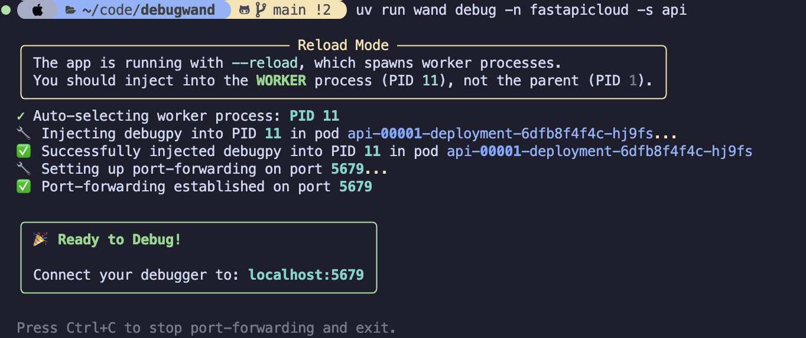

# debugwand 🪄

A zero-preparation remote debugger for Python applications running in local Kubernetes clusters.

*Made possible by the Python 3.14 [remote debugging attachment protocol](https://docs.python.org/3/howto/remote_debugging.html) and [debugpy](https://github.com/microsoft/debugpy)*

> Note: `debugwand` is experimental and not made for production. Use at your own risk.

## Features

- **Zero-preparation debugging** - No code changes or restarts required
- **Full breakpoint debugging** - Using `debugpy`
- **Kubernetes-native** - Handles pod discovery, service routing, and Knative
- **Process selection** - Interactive selection with CPU/memory metrics
- **Script execution** - Run arbitrary Python code in remote processes

## Quick Start

### 1. List pods and processes

```bash
# List pods for a specific service
wand pods -n my-namespace -s my-service

# Show Python processes in pods
wand pods -n my-namespace -s my-service --with-pids
```

### 2. Debug a live process

To start a debugging session, run:
```bash
wand debug -n my-namespace -s my-service
```

This will:
1. Find pods for the service
2. Let you select which process to debug
3. Inject `debugpy` into the process (non-blocking - app continues running)
4. Automatically port-forward to your local machine
5. Your app continues serving requests - connect your debugger anytime!



### 3. Connect your editor

**VSCode**: Press F5 or use this launch configuration:

```json
{
  "version": "0.2.0",
  "configurations": [
    {
      "name": "Attach to Kubernetes Pod",
      "type": "debugpy",
      "request": "attach",
      "connect": {
        "host": "localhost",
        "port": 5679
      },
      "pathMappings": [
        {
          "localRoot": "${workspaceFolder}",
          "remoteRoot": "/app"
        }
      ]
    }
  ]
}
```

**Neovim/Other DAP clients**: Connect to `localhost:5679`

## Requirements

### Local Machine (debugwand CLI)
- **Python 3.14+** (uses `sys.remote_exec()`)
- **kubectl** configured with cluster access

### Target Pods
- **Python 3.14+** runtime
- **debugpy** installed in the container (for `debug` command)


## Other notes

### Knative Services

debugwand automatically handles Knative services by detecting ExternalName services and finding pods via `serving.knative.dev/service` labels.

### Multiple Pods

If a service has multiple pods, debugwand will prompt you to select one. Use the CPU/memory metrics to choose the right instance.

## Troubleshooting

### "No module named 'debugpy'"

The target pod doesn't have debugpy installed. Add debugpy to your application dependencies.

### Debugger won't attach

1. Check port-forward is running: `lsof -i :5679` (or use https://github.com/savannahostrowski/gruyere 🤗)
2. Check debugpy is listening: `kubectl logs <pod> | grep debugpy`
3. Verify path mappings in `launch.json` or DAP config
4. Check Python version compatibility (3.14+ required)

### Breakpoints not hitting

**Path mappings:** Ensure your `launch.json` maps local to remote paths correctly.

**Multiple pods:** If you have multiple replicas, requests may be load-balanced to a different pod than the one you're debugging. Consider scaling down to a single replica during debugging.

## Hot-Reload Support

### Debugging with `--reload`

debugwand automatically handles uvicorn's `--reload` mode:
- Detects when your app runs with `--reload` (FastAPI, Flask, etc.)
- Monitors for worker process restarts
- Auto-reinjects debugpy when the worker PID changes
- Keeps port-forward alive across worker restarts

**Note:** When the worker restarts, VSCode will detach (because the process dies). You'll need to press F5 to reconnect. The worker continues serving requests immediately - debugpy is ready and waiting for you to reconnect.

### How It Works

1. **Start debugging:**
   ```bash
   wand debug -n my-namespace -s my-service
   ```

2. **Connect VSCode** (press F5)

3. **Edit your code:**
   - Tilt syncs files to pod
   - uvicorn detects changes and restarts worker
   - debugwand detects PID change and reinjects debugpy
   - Press F5 in VSCode to reconnect
   - Your breakpoints keep working!

### Example Session

```bash
$ wand debug -n fastapicloud -s api
🔧 Injecting debugpy into PID 82 in pod api-00002...
✅ Debugpy ready in PID 82 in pod api-00002
ℹ️  App is running - connect your debugger anytime to hit breakpoints
🔄 Reload mode detected - will auto-reinject debugpy on worker restarts
🚀 Port-forwarding established on port 5679

# Your app is serving requests! Connect when ready.

# You edit a file...
🔄 Worker restarted (PID 82 → 125), auto-reinjecting debugpy...
✅ Debugpy reinjected into new worker (PID 125)
ℹ️  Worker is running - reconnect your debugger to continue debugging

# Worker keeps serving requests! Reconnect when ready.
# Keep coding! The cycle repeats
```

### VSCode Configuration

Standard debugpy attach configuration works:
```json
{
  "name": "Attach to Kubernetes Pod",
  "type": "debugpy",
  "request": "attach",
  "connect": {
    "host": "localhost",
    "port": 5679
  },
  "pathMappings": [
    {
      "localRoot": "${workspaceFolder}",
      "remoteRoot": "/app"
    }
  ]
}
```

### What You Get

- ✅ **Non-blocking debugging** - App continues serving requests immediately
- ✅ Keep uvicorn `--reload` enabled for fast iteration
- ✅ Workers restart and serve traffic without waiting for debugger
- ✅ Debugpy automatically reinjects on worker restarts
- ✅ Simple F5 press to connect/reconnect anytime
- ✅ Port-forward stays alive across worker restarts
- ✅ Auto-reconnect if entire pod restarts

## Architecture

```
┌─────────────────┐                    ┌──────────────────┐
│  Local Machine  │                    │  Kubernetes Pod  │
│                 │                    │                  │
│  debugwand CLI  │◄───── kubectl ────►│   Python App     │
└────────┬────────┘                    └────────┬─────────┘
         │                                      │
         │ 1. Discover pods                     │
         ├─────────────────────────────────────►│
         │                                      │
         │ 2. List Python processes             │
         │◄─────────────────────────────────────┤
         │                                      │
         │ 3. Select process (auto-detect       │
         │    reload mode and choose worker)    │
         │                                      │
         │4. Inject `debugpy script via         │
         │  (`sys.remote_exec()`)               │
         │                                      │
         ├─────────────────────────────────────►│
         │                                      │
         │                 5. `debugpy.listen()`│
         │                    ┌─────────────────┤
         │                    │                 │
         │ 6. Port-forward    │                 │
         │◄───────────────────┼────────────────►│
         │    localhost:5679  │                 │
         │                    └─────────────────┤
         │                                      │
         │ 7. Connect editor                    │
         ├──────────────────────────────────────┤
         │         Debugging Session            │
         │◄────────────────────────────────────►│
         │                                      │
```

## License

MIT
